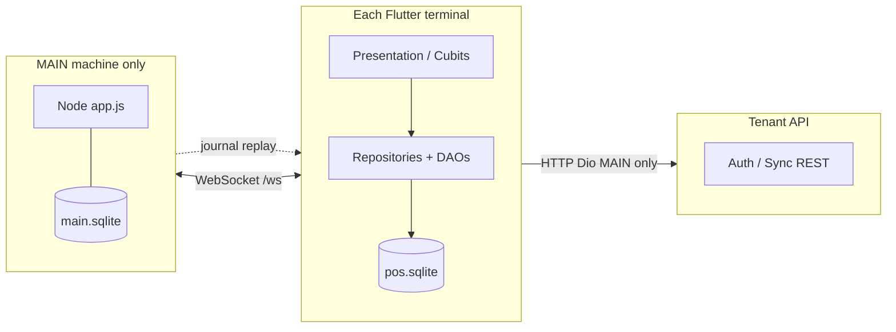
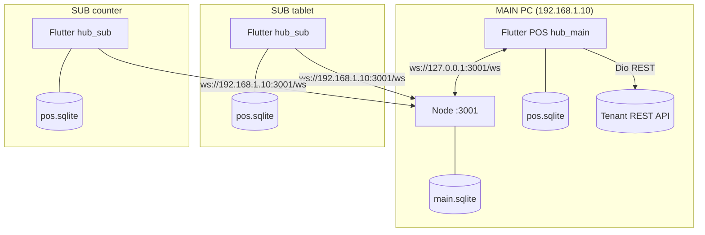
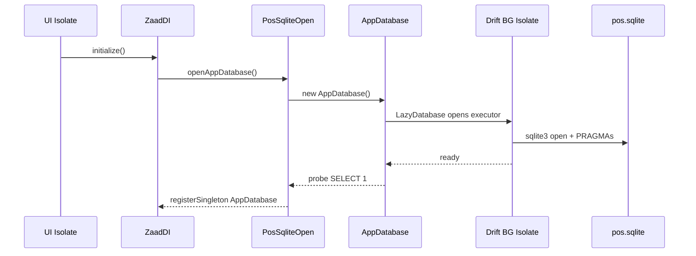
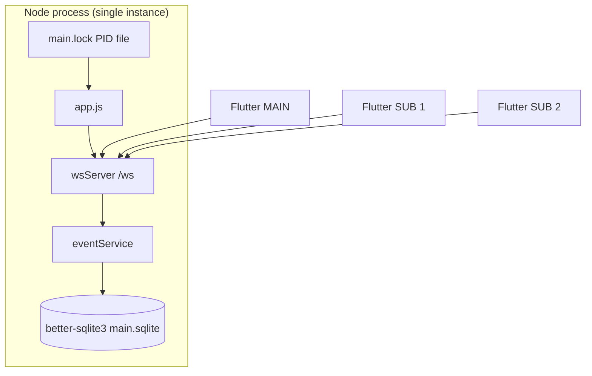
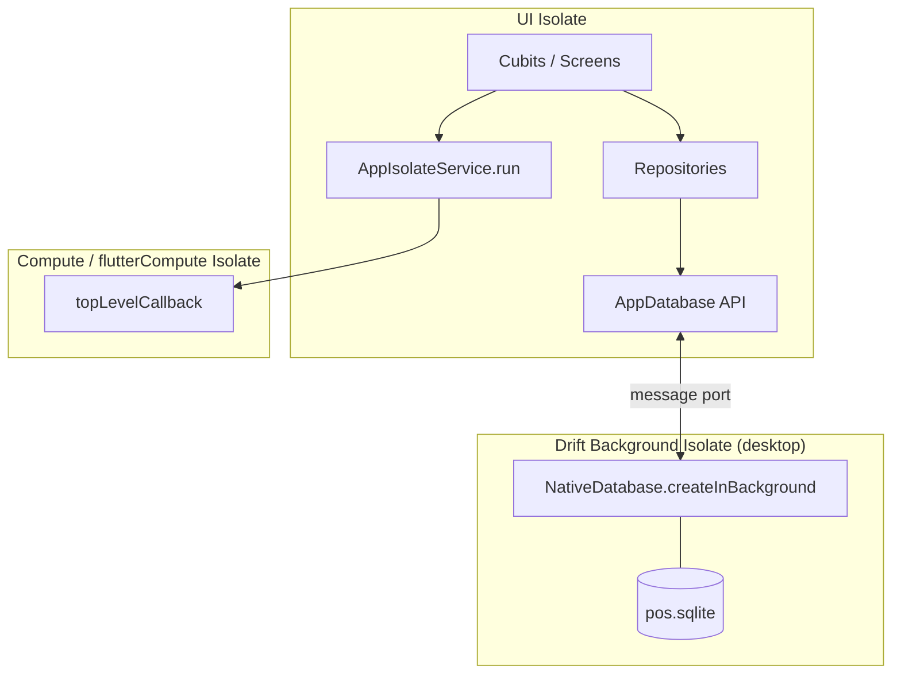
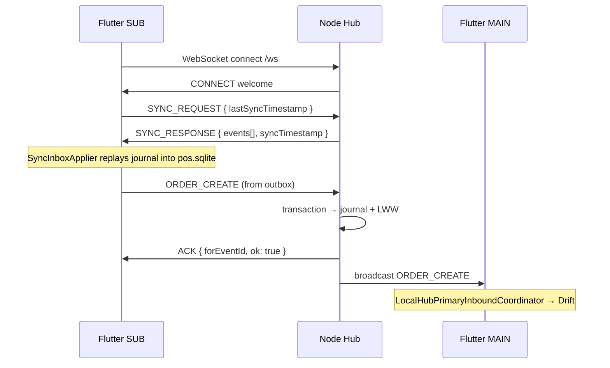
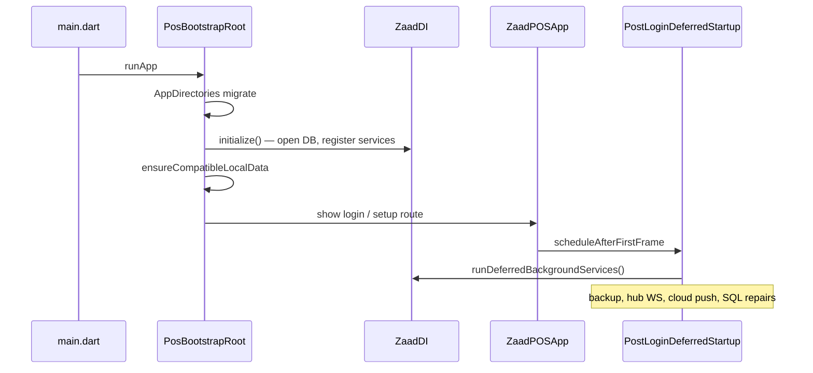
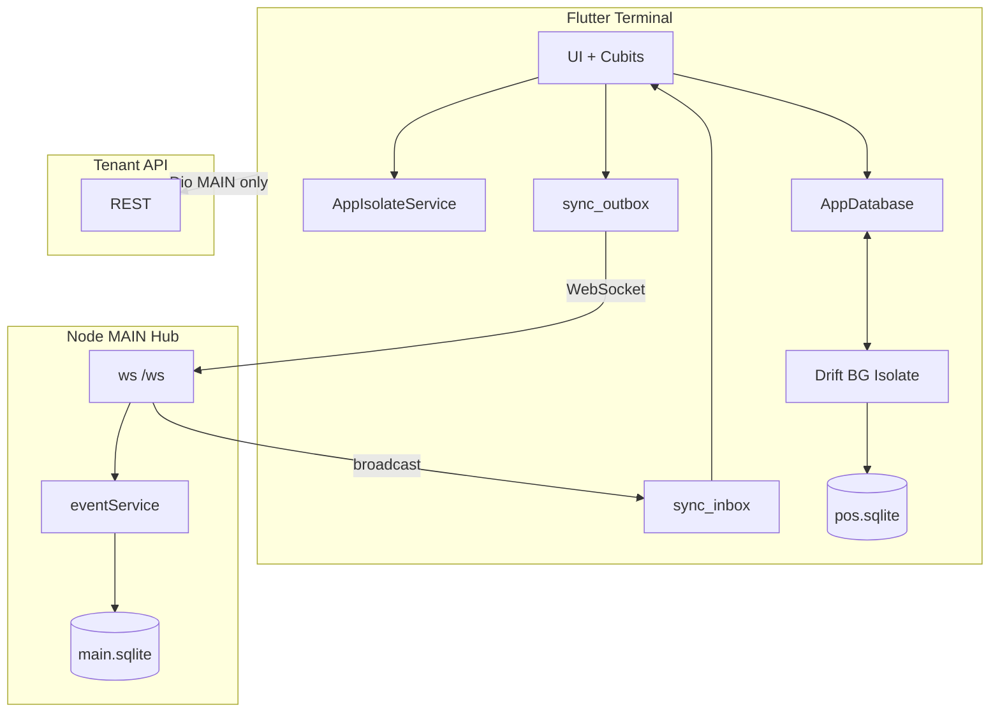

# Zaad POS — Full System Architecture

This document describes how **Flutter client**, **Node.js LAN hub**, **WebSocket sync**, **SQLite databases**, and **Dart isolates** fit together. For product overview and setup, see [`README.md`](README.md).

---

## Table of contents

1. [System overview](#1-system-overview)
2. [Deployment topology](#2-deployment-topology)
3. [Flutter client architecture](#3-flutter-client-architecture)
4. [Database connection model](#4-database-connection-model)
5. [Dart isolates & background work](#5-dart-isolates--background-work)
6. [Node.js LAN hub](#6-nodejs-lan-hub)
7. [WebSocket protocol & sync flow](#7-websocket-protocol--sync-flow)
8. [Cloud REST sync](#8-cloud-rest-sync)
9. [Startup & dependency injection](#9-startup--dependency-injection)
10. [Production paths & configuration](#10-production-paths--configuration)

---

## 1. System overview

Zaad POS is an **offline-first** restaurant/retail POS. Every terminal keeps a full **local SQLite database** (Drift). Sales, KOT, and logs work without network. Optional layers sync data:

| Layer | Technology | Purpose |
|-------|------------|---------|
| **Local DB** | Drift + `sqlite3` on Flutter | Authoritative on-device store (`pos.sqlite`) |
| **LAN hub** | Node.js + `ws` + `better-sqlite3` | Multi-terminal sync on same network (`main.sqlite`) |
| **Cloud API** | Dio REST (tenant) | Login, catalog pull, sales push to backend |



### Three databases, three roles

| Database | Location | Writer(s) | Contents |
|----------|----------|-----------|----------|
| `pos.sqlite` | Each Flutter device | That device's Drift | Full POS schema: catalog, orders, users, sync queues |
| `main.sqlite` | MAIN PC `server/data/` | Node hub (single process) | LWW JSON blobs + event journal for LAN replay |
| Cloud DB | Remote tenant server | Backend API | Master tenant data (catalog, aggregated sales) |

---

## 2. Deployment topology

### MAIN vs SUB

Configured in `LocalHubSettings` (`SharedPreferences`):

| Setting key | Values | Meaning |
|-------------|--------|---------|
| `pos_local_role` | `hub_main` / `hub_sub` | Terminal role |
| `pos_local_hub_ws_url` | e.g. `ws://192.168.1.10:3001/ws` | WebSocket endpoint |
| `pos_installation_device_uuid` | UUID | Stable device id in envelopes |
| `pos_hub_last_journal_ms` | millis | SUB catch-up watermark |



| Role | Runs Node? | Cloud REST | WebSocket clients |
|------|------------|------------|-------------------|
| **MAIN** | Yes (same or separate process) | Full access | Publishes + listens |
| **SUB** | No | **Blocked** (`blocksTenantCloudRest`) | Subscribes only |

**Health check:** `GET http://<host>:3001/health` → `{ ok, role: "MAIN", sqlite, ws: { openSockets, peers } }`

---

## 3. Flutter client architecture

### Layered structure

```
client/lib/
├── main.dart                    # Entry → PosBootstrapRoot
├── app/
│   ├── pos_bootstrap.dart       # Splash, cold start, route to login
│   ├── di.dart                  # GetIt (ZaadDI) — singletons & coordinators
│   ├── routes.dart              # Named routes
│   └── post_login_deferred_startup.dart
├── core/
│   ├── auth/                    # Permissions, session scope
│   ├── network/                 # Dio, LocalHubSettings, health probes
│   ├── sync/                    # Hub coordinators, inbox applier, cloud push
│   ├── isolate/                 # AppIsolateService
│   ├── print/                   # ESC/POS PrintService
│   ├── services/                # BackupService
│   └── utils/                   # AppDirectories, PosSqliteOpen
├── data/
│   ├── local/                   # Drift AppDatabase + DAOs
│   └── repository_impl/         # Drift-backed repositories
├── domain/models/               # Entities + api/ (AuthApi, SyncApi)
├── features/                    # Cross-cutting (orders hub, day closing)
└── presentation/                # Screens + Cubits (Bloc)
```

### Patterns

| Pattern | Implementation |
|---------|----------------|
| **State** | `Cubit` + `BlocProvider` per screen |
| **DI** | `get_it` via `ZaadDI.initialize()` |
| **Data access** | Repository interface → `*_repository_impl.dart` → Drift DAO |
| **Navigation** | Named routes in `Routes` map |
| **Realtime UI** | `HubOrdersLiveSync.revision` stream → debounced reload |

### Sync coordinators (Flutter side)

| Class | Role | When active |
|-------|------|-------------|
| `LocalHubSyncCoordinator` | SUB WebSocket client: outbox flush, inbox apply, reconnect backoff | `hub_sub` + WS URL |
| `LocalHubPrimaryInboundCoordinator` | MAIN listener: ingests SUB-originated orders into MAIN Drift | `hub_main` |
| `HubOrderLanPublisher` | Publishes order mutations to hub | Both (via outbox) |
| `HubCatalogLanPublisher` | MAIN → SUB catalog after tenant pull | MAIN |
| `HubCompanySnapshotPublisher` | MAIN → SUB users/branches/settings | MAIN |
| `SyncInboxApplier` | Applies inbound WS events to Drift | Both |
| `OutboundPushCoordinator` | Pushes unsynced sales to cloud | MAIN only |
| `LanHubReconnectService` | Reconnection policy | SUB |

---

## 4. Database connection model

### Flutter client — Drift + SQLite

**File:** `Documents/ZaadPOS/local/pos.sqlite` (via `AppDirectories.local()`)

**Open path:**

```
main.dart
  → PosBootstrapRoot._runColdStart()
    → ZaadDI.initialize()
      → PosSqliteOpen.openAppDatabase()   // retries, WAL recovery
        → AppDatabase()                     // LazyDatabase
          → _openNativeExecutor(file)
```

**Connection strategy by platform** (`drift_database.dart`):

| Platform | Drift executor | Why |
|----------|----------------|-----|
| **Windows / macOS / Linux** | `NativeDatabase.createInBackground(file)` | SQLite I/O runs in Drift's **background isolate** — UI stays responsive on slow OneDrive paths |
| **Android** | `NativeDatabase(file)` | Public Documents paths fail in Drift background isolate (SQLite error 14) |
| **Tests** | `AppDatabase.memory()` or `AppDatabase.file()` | In-memory or temp file |

**SQLite pragmas** (set on open):

```sql
PRAGMA journal_mode = WAL;
PRAGMA synchronous = NORMAL;   -- FULL caused multi-second stalls on OneDrive
PRAGMA busy_timeout = 30000;   -- 30s wait on lock contention
```

**Resilience** (`PosSqliteOpen`):

- Up to 3 open attempts with exponential backoff
- Stale WAL sidecar recovery when no other process holds lock
- Android fallback from public Documents → internal app storage
- 45s probe timeout with actionable error messages



### Drift schema highlights

- **Schema version:** 55 (migrations in `drift_database.dart`)
- **Tables:** 30+ including `orders`, `order_logs`, `sync_outbox`, `sync_inbox`, catalog, CRM, financial
- **DAOs:** One DAO per domain (`OrdersDao`, `SyncQueueDao`, etc.)
- **Code gen:** `dart run build_runner build` after schema changes

### Sync queue tables (client)

| Table | Purpose |
|-------|---------|
| `sync_outbox` | Events waiting to send to hub (with retry state) |
| `sync_inbox` | Inbound events received, pending or applied |
| `pending_actions` | Deferred local actions |
| `settle_sales_outbox` | Day-closing settlement push queue |
| `day_closing_checkpoint` | Branch day-close watermark |

### Node hub — better-sqlite3

**File:** `server/data/main.sqlite` (or `POS_SQLITE_PATH` env)

**Single-writer model:**

1. `acquireMainLock(dataDir)` — PID lock file prevents two MAIN hubs on one machine
2. One `better-sqlite3` connection for the process lifetime
3. Synchronous writes inside `db.transaction()` per inbound envelope

**Hub schema** (`server/src/db/sqlite.js`):

| Table | Purpose |
|-------|---------|
| `event_journal` | Append-only replay log (`seq`, `event_id`, `envelope`, `effective_ms`) |
| `processed_events` | Idempotency — duplicate `eventId` ignored |
| `inbox` | Raw envelope audit trail |
| `items`, `categories`, `orders`, `kot_entries`, `payments` | LWW JSON blobs (`id`, `json`, `updated_at`) |

**Pragmas:**

```sql
PRAGMA journal_mode = WAL;
PRAGMA synchronous = FULL;     -- Hub is single-writer; durability preferred
PRAGMA foreign_keys = ON;
```



### Data flow: order on SUB → MAIN Drift

1. SUB saves order to local `pos.sqlite` immediately
2. SUB enqueues `ORDER_CREATE` in `sync_outbox`
3. `LocalHubSyncCoordinator` sends envelope over WebSocket
4. Node `eventService` persists to `main.sqlite` journal + LWW `orders` table
5. Node ACKs sender, broadcasts to other peers
6. MAIN `LocalHubPrimaryInboundCoordinator` receives broadcast → `SyncInboxApplier` → MAIN `pos.sqlite`
7. MAIN `OutboundPushCoordinator` pushes to cloud when online

---

## 5. Dart isolates & background work

Flutter uses **two isolate concepts** in this project:

### A. Drift background isolate (automatic)

On desktop, `NativeDatabase.createInBackground` runs all SQLite queries in Drift's dedicated worker isolate. This is **transparent** to application code — repositories call `await db.ordersDao...` on the UI isolate; Drift marshals to the DB isolate.

### B. AppIsolateService (explicit compute)

**File:** `client/lib/core/isolate/app_isolate_service.dart`

Wraps heavy CPU/IO work off the UI thread:

| Platform | Backend | Notes |
|----------|---------|-------|
| Android / iOS | `flutterCompute` (`flutter_isolate` plugin) | Persistent isolate pool |
| Windows / macOS / Linux | `compute()` from Flutter foundation | Short-lived isolates |
| Web | Inline (no isolate) | Runs on main thread |
| Unit tests | `compute()` | No platform channel |

```dart
// Usage pattern everywhere:
await locator<AppIsolateService>().run(topLevelCallback, message);
```

**Registered in:** `ZaadDI.initialize()` as singleton.

**Shutdown:** `AppIsolateService.shutdown()` → `FlutterIsolate.killAll()` on logout (mobile only).

### Work offloaded to isolates

| Task | File | Callback |
|------|------|----------|
| Tenant catalog JSON parse | `pull_response_parse.dart` | `parsePullPageFromRaw` |
| Sales XLSX build | `sales_csv_backup.dart` | `buildSalesWorkbookBytesIsolate` |
| Cloud order upload prep | `sync_service.dart` | `_uploadOrderToServer` |
| Cloud customer upload | `sync_service.dart` | `_uploadCustomerToServer` |
| KOT kitchen diff | `kot_kitchen_update_diff.dart` | `kotKitchenUpdateDiffInIsolate` |
| SQLite backup integrity check | `sqlite_file_backup_async.dart` | `_quickCheckOkPath` |
| Invoice suffix SQL | `cart_cubit.dart` | heavy read queries |
| Print payload build | `print_service.dart` | receipt/KOT assembly |



**Important:** Isolate callbacks must be **top-level or static** functions — no closure over UI state. Pass serializable message objects.

---

## 6. Node.js LAN hub

### Process layout

```
server/
├── src/
│   ├── app.js                 # HTTP + WS bootstrap, SIGINT cleanup
│   ├── config/
│   │   ├── wsConfig.js        # Port, payload limits, heartbeat
│   │   └── db.js              # Optional MySQL (SQLite is default)
│   ├── db/sqlite.js           # Lock, migrate, openDatabase
│   ├── websocket/
│   │   ├── wsServer.js        # WSS attach, heartbeat ping/pong
│   │   └── wsHandler.js       # Message parse → eventService
│   ├── services/eventService.js  # LWW apply, journal, ACK, broadcast
│   └── util/                  # hubLog, socketMeta
├── data/main.sqlite           # Runtime DB
├── node-x64/ / node-x86/      # Bundled Node for Windows installer
└── package.json
```

### HTTP server (`app.js`)

| Route | Method | Response |
|-------|--------|----------|
| `/health` | GET | `{ ok, role: "MAIN", sqlite, ws: { openSockets, peers } }` |
| `*` | * | 404 |

WebSocket mounted at **`/ws`** on same HTTP server (port **3001** default).

### WebSocket server (`wsServer.js`)

- Library: [`ws`](https://github.com/websockets/ws) v8
- `maxPayload`: 15 MiB (catalog images as base64)
- **Heartbeat:** every 30s ping; dead peers terminated (prevents silent NAT drops)
- `clientTracking: true` — peer list for `/health`

### Event service (`eventService.js`)

Core inbound pipeline:

```
validate envelope
  → CONNECT? → welcome + broadcast to peers
  → SYNC_REQUEST? → buildSyncResponse(lastSyncMs) → SYNC_RESPONSE
  → else:
      db.transaction:
        INSERT OR IGNORE processed_events (idempotency)
        applyEventToDomain (LWW upsert/delete)
        recordInbox
        appendJournal (except ACK)
      ACK sender
      broadcast to other peers (not originator)
```

**LWW rule:** `applyDomainLww` compares `updated_at`; older writes are dropped.

---

## 7. WebSocket protocol & sync flow

### Envelope format (`PosSyncEnvelope`)

All frames are JSON:

```json
{
  "eventId": "uuid-v4",
  "type": "ORDER_CREATE",
  "payload": { "orderId": "...", "updatedAt": 1717000000123 },
  "timestamp": 1717000000,
  "deviceId": "installation-uuid"
}
```

| Field | Type | Required | Notes |
|-------|------|----------|-------|
| `eventId` | string | yes | Idempotency key |
| `type` | string | yes | See event types below |
| `payload` | object | yes | Event-specific data |
| `timestamp` | number | yes | Unix **seconds** |
| `deviceId` | string | yes | Stable terminal UUID |

### Event types

| Type | Direction | Purpose |
|------|-----------|---------|
| `CONNECT` | Client → Hub | Handshake; hub replies `CONNECT` welcome |
| `DISCONNECT` | Hub → All | Peer left (deviceId of disconnected client) |
| `SYNC_REQUEST` | SUB → Hub | `{ lastSyncTimestamp: ms }` — request journal replay |
| `SYNC_RESPONSE` | Hub → SUB | `{ events: [{ effectiveMs, envelope }], syncTimestamp }` |
| `ORDER_CREATE` / `ORDER_UPDATE` | Both | Order replication |
| `KOT_CREATE` / `PAYMENT_CREATE` | Both | Kitchen & payment events |
| `ITEM_UPSERT` / `CATEGORY_UPSERT` | MAIN → SUB | Catalog updates |
| `COMPANY_SNAPSHOT` | MAIN → SUB | Users, branches, settings |
| `FLOOR_PLAN_SNAPSHOT` | MAIN → SUB | Dine-in floors/tables |
| `API_MIRROR` | MAIN → SUB | Mirrored tenant REST JSON |
| `DAY_CLOSING_SETTLED` | Both | Day-close watermark |
| `DELETE` | Both | Entity tombstones |
| `ACK` | Hub → Client | `{ forEventId, ok, duplicate? }` |

### SUB catch-up sequence



### Outbox / inbox reliability (Flutter)

**Outbound (`sync_outbox`):**

1. Mutation writes local Drift first
2. Same transaction (or follow-up) inserts outbox row
3. Coordinator sends WS frame when socket open
4. On `ACK` with matching `forEventId` → mark outbox row done
5. On disconnect → exponential backoff reconnect

**Inbound (`sync_inbox`):**

1. Receive WS frame → persist to `sync_inbox`
2. `SyncInboxApplier` applies to domain tables (LWW by `updatedAt` / `effectiveMs`)
3. Bump `HubOrdersLiveSync.revision` for UI refresh

### MAIN dual WebSocket role

On MAIN, two coordinators may run simultaneously:

| Coordinator | Connects as | Ingests |
|-------------|-------------|---------|
| Publisher path (outbox) | Same deviceId | N/A (sends) |
| `LocalHubPrimaryInboundCoordinator` | Listener on loopback | SUB orders, day closing |

This lets MAIN's Drift stay in sync with SUB sales for cloud push.

---

## 8. Cloud REST sync

**HTTP client:** Dio (`DioClient.getInstance()`)

| Flow | Components |
|------|------------|
| Resolve tenant | `AuthApi.getBaseUrl(appId)` |
| Login | `AuthRepository` → users/branches/settings → Drift |
| Pull catalog | `PullDataRepository` + `SyncApi` (paginated) |
| Push sales | `PushRecordsRepository` + `OutboundPushCoordinator` |

**SUB blocking:** `DioClient` attaches interceptor when `LocalHubSettings.blocksTenantCloudRest` — tenant REST calls fail fast on SUB.

**API mirroring (MAIN):** Successful JSON responses can be published as `API_MIRROR` events so SUB applies subset without direct cloud access.

---

## 9. Startup & dependency injection

### Cold start sequence



### `ZaadDI.initialize()` registers

- `AppDatabase`, `AppIsolateService`, `SharedPreferences`
- All repositories (lazy singletons)
- `LocalHubSyncCoordinator`, `LocalHubPrimaryInboundCoordinator`
- `PrintService`, `BackupService`, `OutboundPushCoordinator`
- `LanHubReconnectService`, `LanHubConnectionNotifier`

### `runDeferredBackgroundServices()` (post-login)

- SQLite backup quick-check
- Legacy row repairs
- Auto-backup timer
- Hub WebSocket start (role-dependent)
- Cloud outbound push coordinator

---

## 10. Production paths & configuration

### File system layout

| Path | Component |
|------|-----------|
| `Documents/ZaadPOS/local/pos.sqlite` | Client Drift DB |
| `Documents/ZaadPOS/media/` | Images, `sales_backup.xlsx` |
| `Documents/ZaadPOS/backup/` | SQLite copies |
| `C:\POS\pos.exe` | Windows install (Inno Setup) |
| `C:\POS\server\` | Node hub + bundled Node |
| `C:\POS\server\data\main.sqlite` | Hub DB |
| `C:\zaad\updates\` | Windows in-app updates |

### Environment variables (server)

| Variable | Default | Purpose |
|----------|---------|---------|
| `WS_HOST` | `0.0.0.0` | Bind address |
| `WS_PORT` | `3001` | HTTP + WS port |
| `WS_MAX_PAYLOAD_BYTES` | `15728640` (15 MiB) | Max WS frame size |
| `WS_HEARTBEAT_MS` | `30000` | Ping interval |
| `WS_MAX_CONNECTIONS` | `512` | Connection cap |
| `POS_SQLITE_PATH` | `server/data/main.sqlite` | Hub DB path |

### SharedPreferences keys (client)

| Key | Purpose |
|-----|---------|
| `baseUrl` | Tenant REST root |
| `pos_local_role` | `hub_main` / `hub_sub` |
| `pos_local_hub_ws_url` | WebSocket URL |
| `pos_installation_device_uuid` | Device id in envelopes |
| `pos_hub_last_journal_ms` | SUB sync watermark |
| `pos_terminal_branch_id` | Branch lock for terminal |

### Run commands

```powershell
# Node hub
cd server
npm install
npm run dev          # node --watch src/app.js

# Flutter client
cd client
flutter pub get
flutter run -d windows

# Drift codegen after schema change
dart run build_runner build --delete-conflicting-outputs

# Tests
cd client && flutter test
cd server && npm test
```

---

## Quick reference diagram



---

## See also

- [`README.md`](README.md) — Product overview, features, dev setup
- [`client/lib/core/sync/pos_sync_wire.dart`](client/lib/core/sync/pos_sync_wire.dart) — Envelope types (source of truth)
- [`server/src/services/eventService.js`](server/src/services/eventService.js) — Hub event pipeline
- [`client/lib/data/local/drift_database.dart`](client/lib/data/local/drift_database.dart) — Client schema & open logic
- [`client/lib/core/isolate/app_isolate_service.dart`](client/lib/core/isolate/app_isolate_service.dart) — Isolate wrapper
