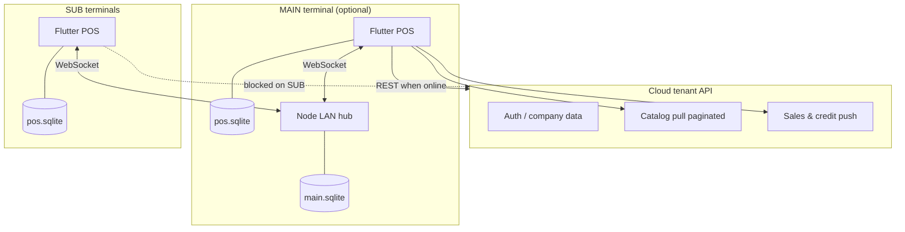
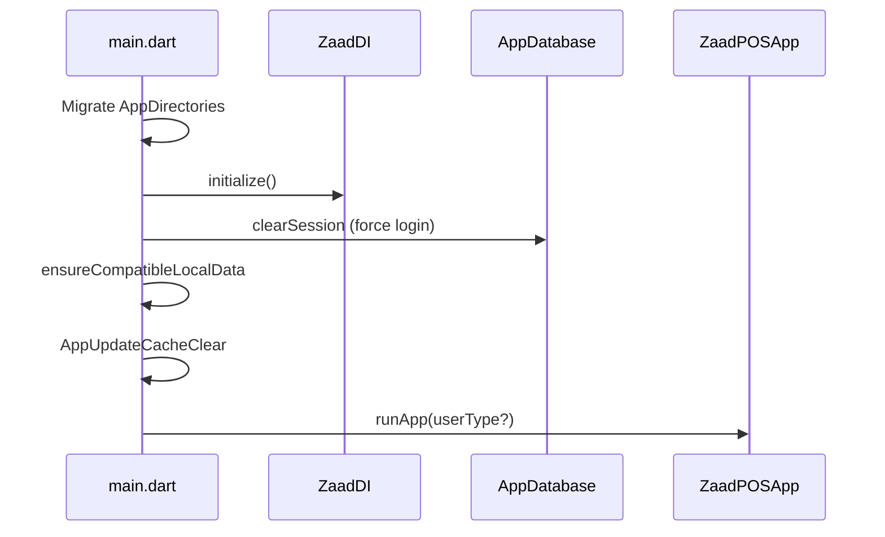

# Zaad POS

**Zaad POS** is an offline-first point-of-sale system for restaurants and retail. It runs on **Windows** and **Android**, keeps a full local database on each device, and optionally syncs with a **cloud tenant API** and/or a **LAN hub** (Node.js WebSocket server) so multiple terminals stay in sync without constant internet.

---

## Table of contents

- [Overview](#overview)
- [Repository layout](#repository-layout)
- [Technology stack](#technology-stack)
- [Architecture](#architecture)
- [Deployment roles: MAIN vs SUB](#deployment-roles-main-vs-sub)
- [Data storage](#data-storage)
- [Sync & networking](#sync--networking)
- [Application features](#application-features)
- [Key user flows](#key-user-flows)
- [Flutter client structure](#flutter-client-structure)
- [Node LAN server](#node-lan-server)
- [Installer & production](#installer--production)
- [Development setup](#development-setup)
- [Testing](#testing)
- [Configuration reference](#configuration-reference)
- [Operational notes](#operational-notes)

---

## Overview

| Aspect | Description |
|--------|-------------|
| **Product** | Multi-channel POS: counter sale, take-away, delivery, dine-in |
| **Model** | Local-first — sales work offline; sync catches up when hub/cloud is available |
| **Platforms** | Flutter: Windows (primary), Android |
| **Hub** | Optional Node.js process on LAN (`server/`) for multi-terminal sync |
| **Cloud** | Tenant REST API (Dio) for login, catalog pull, sales push |
| **Local DB** | SQLite via Drift (`pos.sqlite` on client; `main.sqlite` on hub) |

---

## Repository layout

```
pos/
├── client/          # Flutter POS application (UI, Drift DB, sync, printing)
├── server/          # Node.js LAN hub — HTTP health + WebSocket /ws
├── installer/       # Inno Setup script, VC++ redist, Windows deployment
├── shared/          # Optional docs / contracts (no runtime coupling)
└── README.md        # This file
```

---

## Technology stack

### Client (`client/`)

| Layer | Technology |
|-------|------------|
| UI | Flutter 3.x, Material |
| State | `flutter_bloc` / `bloc` |
| DI | `get_it` |
| Navigation | Named routes (`Routes` map) |
| Local DB | **Drift** + `sqlite3` (WAL journal) |
| HTTP | **Dio** (tenant REST) |
| Realtime | **WebSocket** (`web_socket_channel`) |
| Preferences | `shared_preferences`, `flutter_secure_storage` |
| Printing | `flutter_thermal_printer`, ESC/POS utils |
| Export | Syncfusion XLSIO (`sales_backup.xlsx`) |
| Other | `connectivity_plus`, `mobile_scanner` (hub QR pairing), `package_info_plus` (updates) |

### Server (`server/`)

| Component | Technology |
|-----------|------------|
| Runtime | Node.js ≥ 18 |
| WebSocket | `ws` |
| DB | **better-sqlite3** (`server/data/main.sqlite`) |
| Optional | `mysql2` (configurable; SQLite is default path) |
| Config | `dotenv` — host, port, payload limits |

### Deployment

| Tool | Purpose |
|------|---------|
| Inno Setup (`installer/zaad_pos_setup.iss`) | Bundles Flutter EXE + server + bundled Node |
| PowerShell (`installer/Setup-POS.ps1`) | Post-build deployment helper |

---

## Architecture

High-level view of how pieces connect:



### Design principles

1. **Local-first** — Checkout, KOT, and logs read/write Drift immediately; network is asynchronous.
2. **Outbox / inbox** — LAN events are queued in `sync_outbox` / `sync_inbox` with ACKs for reliability.
3. **Last-write-wins (LWW)** — Hub journal replays events with `effectiveMs` timestamps on MAIN SQLite and SUB Drift.
4. **Permission-driven UI** — Counter features are gated by tenant `permissions` on the user model.
5. **Branch scope** — Orders, invoices, and day-closing are scoped to the active branch session.

---

## Deployment roles: MAIN vs SUB

Configured via `LocalHubSettings` (`SharedPreferences`):

| Role | Who runs Node | Cloud REST | WebSocket |
|------|---------------|------------|-----------|
| **MAIN** (`hub_main`) | This machine (default `ws://127.0.0.1:3001/ws`) | Full: login, pull, push | Publishes orders, catalog snapshots, company snapshot |
| **SUB** (`hub_sub`) | Remote MAIN PC IP | **Blocked** — data comes from hub | Subscribes; applies inbox to local Drift |

- SUB terminals set `hub_ws_url` to the MAIN machine’s LAN address (e.g. `ws://192.168.1.10:3001/ws`).
- MAIN can push **company snapshot** (users, branches, settings) and **catalog** (items/categories with optional base64 images) to SUBs after tenant pull.
- Health check: `GET http://<host>:3001/health` returns `{ ok, role: "MAIN", sqlite, ws }`.

---

## Data storage

### On-device folders (`AppDirectories`)

Under **Documents/ZaadPOS** (Windows) or app documents (Android):

| Path | Contents |
|------|----------|
| `local/pos.sqlite` | Primary Drift database (+ `-wal`, `-shm`) |
| `media/` | Downloaded item/branch images, `sales_backup.xlsx` |
| `backup/` | SQLite file copies (`BackupService`, 3-day retention when sync-clean) |
| `exports/` | Manual XLSX exports (e.g. unsynced orders) |

### Main Drift tables (client)

| Domain | Tables |
|--------|--------|
| Catalog | `categories`, `items`, `item_variants`, `item_toppings`, `topping_groups`, `kitchens`, `kitchen_printers` |
| Sales | `carts`, `cart_items`, `orders`, `order_logs` |
| CRM | `customers` |
| Operations | `drivers`, `delivery_partners`, `dining_floors`, `dining_tables` |
| Org | `users`, `branches`, `sessions`, `settings` |
| Sync | `sync_outbox`, `sync_inbox`, `pull_*` staging, `pending_actions`, `settle_sales_outbox`, `day_closing_checkpoint` |

### Hub database (server)

Domain tables store JSON blobs with LWW (`id`, `json`, `updated_at`) for items, categories, orders, KOT entries, payments, plus an **event journal** for SUB catch-up (`SYNC_REQUEST` / `SYNC_RESPONSE`).

---

## Sync & networking

### 1. Cloud sync (tenant REST)

| Step | Component | Behavior |
|------|-----------|----------|
| Resolve tenant | `AuthApi.getBaseUrl(appId)` | Looks up tenant URL from common host |
| Login | `AuthRepository` / `LoginCubit` | Stores users, branch, settings in Drift |
| Pull catalog | `PullDataRepository` + `SyncApi` | Paginated categories, items, floors, delivery services |
| Push sales | `PushRecordsRepository` + `OutboundPushCoordinator` | Pushes unsynced `order_logs` when online; retries on connectivity |

`LocalHubSettings.blocksTenantCloudRest` is **true** on SUB — SUB must not mutate cloud directly.

### 2. LAN hub sync (WebSocket)

Envelope format (`PosSyncEnvelope`): `eventId`, `type`, `payload`, `timestamp`, `deviceId`.

| Event type | Direction | Purpose |
|------------|-----------|---------|
| `CONNECT` | MAIN → client | Welcome / server time |
| `SYNC_REQUEST` / `SYNC_RESPONSE` | SUB ↔ MAIN | Journal replay for catch-up |
| `ORDER_CREATE` / `ORDER_UPDATE` | Both | Order replication |
| `KOT_CREATE` / `PAYMENT_CREATE` | Both | Kitchen tickets & payments |
| `ITEM_UPSERT` / `CATEGORY_UPSERT` | MAIN → SUB | Catalog updates |
| `COMPANY_SNAPSHOT` | MAIN → SUB | Users, branches, settings |
| `API_MIRROR` | MAIN → SUB | Mirrored REST responses |
| `DAY_CLOSING_SETTLED` | Both | Day-close watermark |
| `DELETE` | Both | Entity tombstones |
| `ACK` | Both | Outbox acknowledgment |

**Client coordinators:**

| Class | Role |
|-------|------|
| `LocalHubSyncCoordinator` | SUB: WebSocket client, outbox flush, inbox apply, reconnect backoff |
| `LocalHubPrimaryInboundCoordinator` | MAIN: inbound WS handling into Drift |
| `HubOrderLanPublisher` | Publishes order mutations to hub |
| `HubCatalogLanPublisher` / `HubCompanySnapshotPublisher` | MAIN → SUB catalog & identity |
| `SyncInboxApplier` | Applies inbound events to Drift |
| `HubOrdersLiveSync` | Notifies UI (Recent Sales, logs) to refresh |
| `LanHubReconnectService` | Reconnection policy |

### 3. Live UI refresh

Screens such as **Recent Sales**, **Take Away Log**, **Delivery Log**, and **Dine In Log** listen to `HubOrdersLiveSync.revision` and reload orders when the hub signals changes (debounced ~200ms).

---

## Application features

### Sales channels

| Channel | Route / entry | Notes |
|---------|---------------|-------|
| **Take away** | Counter → `orderType: take_away` | KOT → pay → completed |
| **Counter sale** | Permission `counter_sale` | Quick retail-style sale |
| **Delivery** | Delivery partner picker → counter | Partner-specific catalog filter |
| **Dine in** | Floor/table map | Table reference, split/move in log |

### Order logs (open / in-progress)

| Screen | Shows |
|--------|-------|
| Take Away Log | Unpaid / KOT take-away orders |
| Delivery Log | Delivery orders in progress |
| Dine In Log | Table orders; move table, split |
| Driver Log | Driver assignment view |

### Back office (counter permissions)

| Feature | Description |
|---------|-------------|
| **Recent Sales** | Completed orders; filter, reprint, edit/delete (permission-gated) |
| **Credit sales** | Credit bills; pay credit |
| **Day closing** | Settlement summary vs checkpoint; LAN sync of close state |
| **CRM** | Customer list and details |
| **Orders** | General orders list (admin-style) |

### Settings & hardware

| Feature | Description |
|---------|-------------|
| **Settings** | Runtime app settings from local DB |
| **Printer settings** | Thermal printer selection & layout |
| **LAN hub settings** | MAIN/SUB role, WS URL, QR scan pairing, branch lock |
| **Auto sync screen** | Initial catalog pull progress UI |

### Printing & peripherals

- KOT and receipt generation via `PrintService` (ESC/POS).
- Cash drawer pulse on payment (`cash_drawer_on_payment.dart`) when configured.

### Updates & resilience

| Feature | Description |
|---------|-------------|
| `BackupService` | Periodic SQLite copies under `backup/` |
| `SalesCsvBackup` | Full-branch XLSX mirror in `media/sales_backup.xlsx` |
| `AppStartup.ensureCompatibleLocalData` | Schema migration / incompatible DB reset |
| `AppUpdateCacheClear` | Clears ephemeral caches on app version bump |
| `UpdaterManager` | Windows in-app updates (`C:\zaad\updates\`) |

### User roles

| Role | Dashboard |
|------|-----------|
| **Admin** | Placeholder admin home (module planned) |
| **Counter** | `CounterHome` — permission-filtered tile grid |

Permissions are normalized in `CounterAccess` (take away, delivery, dine in, recent sales, logs, CRM, day closing, etc.).

---

## Key user flows

### Cold start



### Checkout (simplified)

1. `CartCubit` holds active cart lines (variants, toppings, discounts).
2. Payment → `OrderRepositoryImpl` writes `orders` + `order_logs`.
3. `_afterMutation`: XLSX backup + SQLite backup + hub publish + cloud push schedule.
4. `PrintService` prints receipt/KOT.
5. SUB peers receive `ORDER_*` via WebSocket and refresh logs.

### Tenant onboarding

1. Enter app ID → resolve `baseUrl`.
2. Login → pull company snapshot into Drift.
3. If MAIN: optional auto catalog LAN publish after pull.
4. If SUB: point WS URL at MAIN; receive `COMPANY_SNAPSHOT` + journal.

---

## Flutter client structure

```
client/lib/
├── main.dart                 # Entry, migrations, DI, forced login on cold start
├── app/                      # App widget, routes, DI (GetIt), navigation, startup
├── core/
│   ├── auth/                 # Counter permissions, session
│   ├── constants/            # Colors, enums (OrderType, UserType, …)
│   ├── debug/                # Agent debug logging
│   ├── network/              # Dio, hub settings, SSL, health
│   ├── print/                # Thermal print, cash drawer
│   ├── services/             # BackupService
│   ├── sync/                 # Hub coordinators, inbox applier, cloud push
│   ├── update/               # UpdaterManager, idle monitor
│   └── utils/                # App dirs, images, invoices, order utils
├── data/
│   ├── local/                # Drift DB, DAOs, generated code
│   └── repository_impl/      # Repository implementations
├── domain/
│   └── models/               # Entities + api/ (AuthApi, SyncApi, Dio)
├── features/                 # Feature-specific data (orders hub, day closing)
└── presentation/             # Screens, cubits, widgets
    ├── login/
    ├── dashboard/            # Routes to CounterHome or AdminHome
    ├── counter/              # Counter dashboard tiles
    ├── sale/                 # Cart + catalog (desktop/mobile layouts)
    ├── recent_sales/
    ├── take_away_log/ dine_in/ dine_in_log/ delivery_log/
    ├── credit_sales/ day_closing/ crm/ orders/
    └── settings/
```

**Patterns:** Repository interfaces in `data/repository/`, implementations use Drift DAOs; UI uses **Cubit** + `BlocProvider` per screen; singletons registered in `ZaadDI`.

---

## Node LAN server

```
server/
├── src/
│   ├── app.js              # HTTP server + WS attach, SIGINT cleanup
│   ├── config/wsConfig.js  # Port 3001, 15 MiB max payload, heartbeat
│   ├── db/sqlite.js        # Open DB, MAIN file lock
│   ├── websocket/
│   │   ├── wsServer.js     # WSS setup, connection limits
│   │   └── wsHandler.js    # Parse envelopes → eventService
│   ├── services/
│   │   └── eventService.js # LWW domain apply, broadcast, ACK, journal
│   └── util/               # Hub traffic logging, socket metadata
├── data/                   # main.sqlite (runtime)
└── package.json
```

**Run locally:**

```powershell
cd server
npm install
# optional: copy env.example to .env — WS_PORT, WS_HOST, POS_SQLITE_PATH
npm run dev
```

Default: `ws://0.0.0.0:3001/ws`, health at `http://0.0.0.0:3001/health`.

---

## Installer & production

1. Build Flutter: `cd client && flutter build windows`
2. Compile `installer/zaad_pos_setup.iss` (Inno Setup)
3. Default install path: **`C:\POS`**
   - `pos.exe` — Flutter client
   - `server/` — Node hub + bundled `node-x64` / `node-x86`
4. Installer can run `npm install` in server folder and start Node on first launch.

Production DB paths:

| Component | Typical path |
|-----------|----------------|
| Client SQLite | `Documents\ZaadPOS\local\pos.sqlite` |
| Hub SQLite | `C:\POS\server\data\main.sqlite` or `POS_SQLITE_PATH` |
| Updates | `C:\zaad\updates\` |

---

## Development setup

### Server

```powershell
cd server
npm install
npm run dev
```

### Client

```powershell
cd client
flutter pub get
flutter run -d windows
# or: flutter run -d <android_device>
```

Configure in app:

- **Tenant:** login flow sets `baseUrl` in SharedPreferences.
- **LAN hub:** Settings → LAN Hub (MAIN/SUB, WebSocket URL).

### Code generation (Drift)

After schema changes:

```powershell
cd client
dart run build_runner build --delete-conflicting-outputs
```

---

## Testing

| Area | Location |
|------|----------|
| Flutter unit/integration | `client/test/` — sync, invoices, hub LAN, drift CRUD, day closing, etc. |
| Server | `server/test/hub_sub_ws_integration.test.js` (`npm test`) |

```powershell
cd client
flutter test

cd server
npm test
```

---

## Configuration reference

| Key / env | Where | Purpose |
|-----------|-------|---------|
| `baseUrl` | SharedPreferences | Tenant REST root |
| `pos_server_base_url` | SharedPreferences | Legacy/alternate hub HTTP base |
| `hub_role` | SharedPreferences | `hub_main` or `hub_sub` |
| `hub_ws_url` | SharedPreferences | WebSocket URL (required on SUB) |
| `WS_PORT` | server `.env` | Default **3001** |
| `WS_MAX_PAYLOAD_BYTES` | server `.env` | Default **15 MiB** (catalog images) |
| `POS_SQLITE_PATH` | server `.env` | Hub SQLite file path |

---

## Operational notes

Long-running terminals should be monitored for:

- **Disk:** `pos.sqlite` + WAL, `sync_inbox` / `sync_outbox`, `media/` image orphans, `backup/` copies (every ~2 min on MAIN), and `sales_backup.xlsx` full rewrites grow with order history.
- **Memory:** Screens that load **all** orders (Recent Sales, day closing, credit sales) and the full item catalog in `ItemsCubit` scale with tenant size.
- **Performance:** Prefer date-bounded queries and list virtualization for high-volume sites; schedule DB maintenance (`wal_checkpoint` / prune) on idle hubs.

---

## Related docs

- [`client/README.md`](client/README.md) — Flutter client quick start
- [`client/lib/features/orders/README.md`](client/lib/features/orders/README.md) — Orders hub integration notes

---

## License

ISC (server). Client is private (`publish_to: 'none'` in `pubspec.yaml`).
